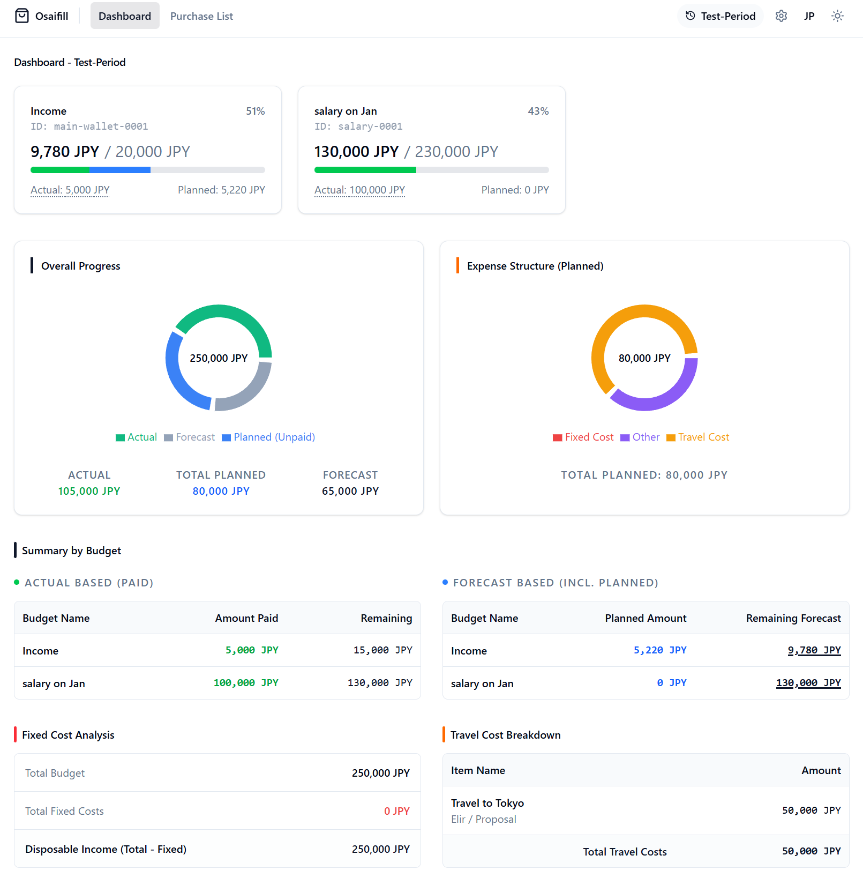

# Osaifill

[](https://opensource.org/licenses/MIT)

**Osaifill** is a multi-source household account book application designed to bridge the gap between planned shopping lists and actual expenses. It visualizes "Remaining Forecasts" across multiple budgets (wallets) through a unique status-based calculation logic.

---

## 📸 Screenshots



---

## 💡 Operational Concept: Planned vs. Actual

Osaifill manages "Planned" (Shopping List) and "Actual" (CSV Imports) separately without direct matching. This allows for a flexible and realistic budget management.

### Status-based Calculation
The calculation of "Remaining Forecast" changes based on the status of each item in the purchase list:
- **Proposal / Estimated**: Treated as "Planned" expenses. Deducted from the remaining forecast.
- **Shopping**: In-progress items. Still treated as "Planned" for calculation.
- **Purchased**: Completed items. These are expected to be replaced by "Actual" expense data (via CSV import), so they are **excluded** from the "Planned" calculation to avoid double-counting.
- **Not Purchasing**: Cancelled items. Excluded from all calculations but kept in the list for history.

---

## 🌟 Key Features

- **Period (Dataset) Management**: Separate your data by year, month, or event. Easily switch between current and archived household data.
- **Dynamic Rollover**: Transition to a new period while carrying over members, CSV mapping settings, and combined remaining balances from the previous period.
- **Smart Shopping List**: Powerful search (regex supported), filtering, and sorting to handle large lists efficiently. Supports priority levels and category tagging.
- **Visual Analytics**: Real-time progress tracking with stacked progress bars and interactive charts (Recharts). Visualizes both "Actual-based" and "Forecast-based" remaining amounts.
- **Advanced CSV Import/Export**: 
  - Drag & Drop support for CSV files.
  - Custom column mapping that remembers your settings per dataset (both for Purchases and Actual Expenses).
  - Localization support for exported files.
- **Highly Customizable**:
  - Global display unit settings (USD, JPY, etc.).
  - Centralized font size control (Semantic UI sizing).
  - Dark/Light mode support.
- **Multi-language**: Full support for English and Japanese.

---

## 🛠️ Tech Stack
- **Backend**: FastAPI, SQLAlchemy, Pydantic, SQLite (Python 3.10+)
- **Frontend**: React (Vite), Tailwind CSS v4, Lucide React, Recharts
- **Infrastructure**: Docker, Docker Compose

---

## ⚙️ Setup

### 1. Environment Configuration
Copy the `.env.example` to `.env` and adjust the settings if necessary.

```bash
cp .env.example .env
```

### 2. Run with Docker (Recommended)
Docker Compose handles database persistence by mounting the backend directory.

```bash
docker compose up -d --build
```
Access the app at `http://localhost:8080`.

### 3. Manual Setup (Development)

**Backend (FastAPI):**
```bash
cd backend
python -m venv venv
source venv/bin/activate  # venv\Scripts\activate on Windows
pip install -e .
uvicorn osaifill.main:app --reload
```

**Frontend (React/Vite):**
```bash
cd frontend
npm install
npm run dev
```
Access the dev server at `http://localhost:5173`.

---

## 🚀 Getting Started
1. On first launch, create your first **Period (Dataset)** (e.g., "Fiscal Year 2025").
2. Go to **Settings** to register **Members** and set your preferred **Display Unit**.
3. Create **Budgets** (Wallets).
4. Start adding items to your **Purchase List** and distribute the cost among your budgets.
5. Import **Actual Expenses** from your bank or credit card CSV to see your real household status.

---

## 📄 License
This project is licensed under the [MIT License](./LICENSE).

---
---

# Osaifill (おさいふぃる) - 日本語

複数の予算源（財布）に対し、予定（お買い物リスト）と実績（CSV）を分離管理し、正確な「余り予測」を可視化するマルチソース家計簿アプリです。

---

## 📸 スクリーンショット


---

## 💡 運用コンセプト：予定と実績の分離

Osaifillは、お買い物リスト（予定）とCSVインポート（実績）をあえて紐付けずに管理します。これにより、家計の「今」と「これから」を柔軟に把握できます。

### ステータスによる計算ロジック
お買い物リストのアイテムは、ステータスに応じて「余り予測」の計算対象が切り替わります：
- **提案 / 見積済み**: 「支払予定」として扱われ、余り予測から差し引かれます。
- **買い物中**: 買い物中のアイテムです。引き続き「支払予定」として計算されます。
- **購入済み**: 購入が完了したアイテムです。これらはCSVインポートによる「実績データ」に置き換わる前提のため、二重計上を防ぐために予定額の計算からは**除外**されます。
- **購入しない**: 計画が中止されたアイテムです。履歴としてリストに残りますが、すべての計算から除外されます。

---

## 🌟 主な機能

- **期間（データセット）管理**: 年度、月、イベントごとにデータを完全に分離。過去の家計データの閲覧・編集もスムーズに切り替え可能です。
- **データ繰り越し（Rollover）**: メンバー、CSVマッピング設定、および前期間の実績ベースの余り予算をまとめて新しい期間へ引き継げます。
- **高度なお買い物リスト**: 正規表現対応の検索、ステータス・カテゴリ・担当者による絞り込み、柔軟なソート機能を搭載。優先度設定や備考欄も活用できます。
- **直感的なダッシュボード**: 実績ベース（支払済）と予測ベース（予定含む）の2つの視点で予算の余りを可視化。Rechartsによる動的なグラフ表示に対応。
- **CSVインポート/エクスポート**: 
  - ドラッグ＆ドロップ対応。
  - お買い物リストと予算別実績のそれぞれで、柔軟な列マッピング設定が可能（自動保存機能付き）。
  - 表示言語（日本語/英語）に合わせた多言語出力。
- **カスタマイズ性**:
  - 自由な表示単位設定（JPY, USD, 円 など）。
  - フォントサイズの一括設定（Semantic UI sizing準拠）。
  - ダーク/ライトモード対応。
- **多言語対応**: 日本語と英語を完全にサポートしています。

---

## 🛠️ 技術スタック
- **Backend**: FastAPI, SQLAlchemy, Pydantic, SQLite (Python 3.10+)
- **Frontend**: React (Vite), Tailwind CSS v4, Lucide React, Recharts
- **Infrastructure**: Docker, Docker Compose

---

## ⚙️ セットアップ

### 1. 環境設定
`.env.example` を `.env` にコピーして、必要に応じて設定を編集してください。

```bash
cp .env.example .env
```

### 2. Docker で起動 (推奨)
Docker Compose を使用すると、データベース（`backend/osaifill.db`）の永続化を含めて簡単に起動できます。

```bash
docker compose up -d --build
```
`http://localhost:8080` でアプリにアクセス可能です。

### 3. 手動起動 (開発用)

**バックエンド (FastAPI):**
```bash
cd backend
python -m venv venv
source venv/bin/activate  # Windows の場合は venv\Scripts\activate
pip install -e .
uvicorn osaifill.main:app --reload
```

**フロントエンド (React/Vite):**
```bash
cd frontend
npm install
npm run dev
```
`http://localhost:5173` で開発サーバーにアクセス可能です。

---

## 🚀 はじめに
1. 起動後、まず最初の **管理期間（データセット）** を作成します（例：「2025年度」など）。
2. 「設定」から **メンバー** の登録と、好みの **表示単位** を設定してください。
3. **予算** （財布）を作成します。
4. 「お買い物リスト」に予定を登録し、どの予算からいくら出すかを割り当てます。
5. 銀行やカードのCSVから **実績** をインポートして、正確な家計状況を確認しましょう。

---

## 📄 ライセンス
本プロジェクトは [MIT License](./LICENSE) のもとで公開されています。
